# The AI Coding Workflow That Remembers Your Codebase

## Overview

Most AI coding workflows are forward-looking. They generate a PRD, write an architecture doc, break it into stories, and hand each story to the agent. The artifacts describe what to build, live for the length of one project, and are discarded afterwards. The next task starts from zero.

This workflow inverts the starting point. Before any planning happens, it asks a different question:
**What does the code already do, and how does that understanding survive between tasks?**

The answer is a persistent shadow documentation tree that mirrors the actual codebase. Each source file can have a corresponding onboarding markdown capturing its logic, conventions, invariants, and cross-repo edges. This tree exists across all tasks — it isn't built for any single one. It grows organically as the codebase is touched, it tracks its own staleness against git, and it makes cross-repository contracts first-class instead of leaving them implicit.

Plus it is extremely easy to retrieve because the doc path is derived from the code path, so the agent can open the relevant file alongside the code rather than having to search for it.

Around this persistent context layer sits a six-phase task workflow — Creation, Research, Design, Plan, Implementation, Closure — with review gates between phases and feedback loops that let any stage walk back to an earlier one when reality disagrees with the plan. Task-local documentation artifacts (inputs, outputs) are being generated from global onboarding. Inputs form the scope and annotate likely changes. Outputs project future behaviour in code and intent. Outputs help to shape design and make sure agent and developer are on the same page before implementation. The outputs then get further grounded and refined in code during implementation; This workflow makes sure that transient task local documentation remains seperated from the global onboarding tree until the code is reviewed and ready to merge. This prevents that half-baked speculation poisens the global knowledge layer.

This document describes the design: the persistent onboarding layer that makes it work, the phase-by-phase workflow that runs on top of it, and the principles behind both - most importantly that **the developer remains an upstream participant rather than a downstream reviewer.**

---

## The Onboarding System — What Makes This Different

Most systems in this space fall into one of two camps. **Task workflow systems** (BMAD, GSD, GitHub Spec Kit) orchestrate _what to build_: PRDs, architecture docs, epic sharding, story files, phase gates. **Memory and context systems** (graphify, Ix, claude-mem, V-NOC) persist understanding of the _existing code_: knowledge graphs, call graphs, structural extraction, semantic search.

This workflow covers both — and the two layers are designed against each other rather than bolted together. The persistent onboarding tree is the substrate the task workflow runs on, and the task workflow is what keeps the onboarding tree honest, current, and growing. Neither half works the same way without the other.

That matters because the failure modes of the two problems are intertwined. A task workflow with no persistent memory starts every task from a blank slate and forces the agent to rediscover the codebase each time — which is where comprehension failures enter and where silent regressions get introduced. A memory system with no task workflow has no mechanism for validating what it stores or promoting new knowledge safely — speculation contaminates the canonical layer, staleness accumulates, and no structural discipline enforces when updates should happen. Solving one without the other leaves the other's failure mode intact.

### What the onboarding layer contributes

- **Retrieval by construction, not by search.** The onboarding tree is not a centralized wiki. It mirrors the codebase's directory structure one-to-one, so an agent reading src/Backend/UserController.php knows without searching that the corresponding documentation is at onboarding/src/Backend/UserController.md. Retrieval is a path derivation rather than a search — cheap enough to do every time rather than once at the start of a task. Relevance is guaranteed by construction: the doc at that path is tightly scoped to the code file it's about, so there's no wasted read and no risk of the agent having through an entire wiki to find that one relevant piece of information or not finding stuff and concluding that documentation isn't useful. Centralized wikis fail this test on both counts — retrieval cost is high and relevance is a gamble — which is why agents so often get "lazy" on those.
- **Parallel reading, not upfront skim.** Because retrieval is effectively free, agents open onboarding files alongside the code files they're looking at rather than skimming everything once at task start. The documentation gets the same attention and freshness as the code file currently being worked on. This matters because information read earlier in a context window and then buried under hundreds of tokens of subsequent code tends to degrade — the agent still has it, but not with the same clarity as what it read most recently. Onboarding files being re-opened alongside their code keeps them at the top of attention exactly when they're relevant.
- **Persistent understanding of the existing code.** A shadow documentation tree mirrors the codebase. Each source file can have a corresponding onboarding markdown capturing logic, conventions, invariants, cross-repo edges, and technical references. The tree is not built for a task — it exists across all tasks and grows organically as code is touched.
- **Encodes what code cannot say on its own.** Invariants the code assumes but doesn't state. Conventions with social rather than syntactic enforcement. The _why_ behind a pattern. Cross-repo contracts that live between two repositories and are owned by neither. This is information that cannot be recovered by any static analyzer because it was never in the code in the first place — it lives in the developer's head until the onboarding tree gives it somewhere to live.
- **Git-anchored staleness detection.** Each onboarding file tracks its code companions' last verified commit hash and -date. Drift between the code and existing documentation is detectable before any task begins, so the agent never plans against an outdated model of the system.
- **Cross-repo edges are first-class.** The tree explicitly maps system-crossing behavior — API calls, WebSocket events, MQTT topics, shared types, etc. — across repository borders. Changes in one repo that would silently break a contract in another are surfaced during planning instead of discovered in production.
- **Markdown-in-repo substrate.** The onboarding tree lives in its own repo alongside the code it documents. It's diff-able, code-reviewable, and readable by any human without special tooling. The knowledge layer is open and participates in the normal engineering workflow rather than sitting in an opaque backend.
- **Collaborative maintenance, not one-way generation.** Onboarding files are not an agent-only artifact. Developers can write directly into them like a notepad. Also agents are actively prompted to capture new insights as they surface in conversation — a dedicated skill encourages the agent to ask "should I write this down?" when the developer mentions something important that isn't yet in the onboarding. The knowledge layer grows through shared authorship, which is the only way for it to encode things the code genuinely cannot say.
- **Developer read-along during AI-assisted work.** When an agent reads an onboarding file during a task, the developer can read it alongside. This surfaces the agent's current understanding of the system in a form the developer can verify in real time, rather than having to infer from its outputs what it thinks the code does. It's also a rediscovery tool when the developer returns to old code — reading the captured intent often helps to analyze the code a lot faster, especially for narrow edge-case logic that was written to handle a specific problem and takes a hot minute to understand months later without the original context.
- **Accelerates human onboarding, not just agent onboarding.** The same properties that make onboarding files useful to agents make them useful to new engineers, cross-team contributors, and anyone working outside their usual area of the codebase. A single co-located layer combines things that normally live in separate systems: code-level invariants, architectural conventions, cross-repo edges, references and links to external technical documentation. A new engineer no longer has to discover which external documentation exists, where it lives, or what terminology to search for. The onboarding is the bridge between the code they're reading and every other information source that explains it — and in environments where the code and the external docs are in different languages, or scattered across wikis, Confluence spaces, and forgotten README files, that bridge is the difference between "I can start contributing this week" and "I'll be guessing at things for months."
- **Bootstrappable on demand.** A repository with no onboarding can start with a bare `overview.md` and extend organically as tasks touch new areas. Full upfront mapping is not required.

### What the task workflow contributes

- **A phased task structure that enforces process instead of hoping for it.** Six phases — Creation, Research, Design, Plan, Implementation, Closure — with review gates between each. LLMs have no meta-awareness of skipped workflow steps; the phase structure itself has to enforce sequencing, because advisory skills and tracking files will not.
- **Task-local input and output artifacts.** Inputs pull the relevant subset of onboarding files into task scope and annotate them with expected changes. Outputs contain projected structural code and stated intent in the same file, creating a dual-layer diff that catches inconsistencies between what the code does and what the developer thinks it does.
- **Two-resolution comprehension checking.** The input file tree gives coverage checking — does the agent understand the territory. Per-file commentary gives intent checking — does the agent understand what's going to happen to each piece. Missing branches in the tree surface scope misunderstandings cheaply, before they cascade into wasted implementation work.
- **Bidirectional walk-back instead of a one-way pipeline.** When a later phase reveals that an earlier phase was wrong — a missing scope branch, a contradiction between intent and implementation — the workflow makes it easy to walk back to the earlier phase and fixes it upward rather than patching forward. Cheap artifacts make this affordable instead of disastrous.
- **Review gates at every phase boundary.** Human judgment lands at specific moments rather than being required continuously or eliminated entirely. The developer is an upstream participant, not a downstream reviewer.

### What the integration contributes

**Code designing as a first-class activity**

The single most important capability that emerges from combining both layers is something neither achieves on its own:

**The ability to fully design a task — code and intent — before touching the codebase.**

The workflow makes this concrete through the input and output project documentation.

The input layer pulls the relevant subset of onboarding files into the task scope and annotates each one with what might change, based on the requirements. Alongside that, a behavior inventory fixes which existing features and functionality must be preserved, so nothing gets silently dropped during the work. The inventory is grounded on the input project documentation + code — so the record of what must survive the change is itself verifiable rather than relying on the developer's memory of what the system does. A synthesis process helps to nail down any remaining unknowns before starting the design phase.

The output layer is where the designing actually happens. For each file that will change, the agent writes a projected version that captures two things at once:

- **Code projection** — the structural skeleton of the change. Object fields, method signatures, what calls what, the shape of the control flow, and the full logic. Not syntactically perfect; the agent has no IDE tools during projection and may reference methods that no longer exist or miss imports. That doesn't matter. What matters is whether the data structures carry the right fields, whether the methods cover the required functionality, whether the logic holds together as a design. Syntax is what the IDE and compiler catch during implementation. Projection exists to catch what they can't.

- **Intent** — the reasoning that justifies the projected code. Why this shape rather than another. How the change fits the larger system. Which invariants are being preserved, broken, or newly established. Which items in the behavior inventory are being addressed, and how.

Both live in the same file. Both are written at the same time. An agent is forced to think through code through two totally different angles at the same time. On the implementation (micro) and the architectural (macro) level:

- **The micro level** — is this code going to do what we want at the level of fields and methods and control flow. Is the logic sound. Does it cover the necessary cases.

- **The macro level** — does this change make sense as part of the system, does it honor the invariants, etc.

Designing around only one at a time creates blindspots. Micro level alone misses the bigger picture, while focusing only on the macro level can overlook critical details. A lot of workflows spend too much time in the ivory tower and may fall apart once you try to implement.

Once the output layer is accepted, **stitching the implementation plan together becomes almost trivial**. The hard work — what needs to change, how it should be shaped, why it makes sense — has already been done. The implementation plan stops being a planning document and becomes a coordinator: it sorts and schedules the work, identifies dependencies between changes, and orders the waves. The decisions that traditionally happen during implementation planning have already been made during projection, and the output layer serves as both the specification and the design rationale.

During implementation, the projected code meets real code. Syntax gets corrected against IDE feedback. Method names are updated to match the actual APIs. Any insights that emerge from contact with reality are captured in the output layer — which iterates in parallel with the code — so the final version of the output documentation reflects what actually worked, not what was originally guessed. Only the validated version gets promoted back into the global onboarding tree.

None of this is possible without both layers present. A task workflow without persistent memory has no grounded behavior inventory to project against — the agent is guessing what currently exists. A memory system without a task workflow has nowhere to do the projection and no validated moment to promote it back into canonical knowledge. Code planning as a deliberate, reviewable phase — separate from both design docs and implementation — exists in the seam between the two layers, and only emerges when that seam is designed deliberately rather than improvised.

The two layers being a "Task management system" and the "Memory persistence layer" reinforce each other in ways that neither achieves alone:

- **Tasks compound.** Task N+1 starts from the onboarding that tasks 1 through N built up. The agent doesn't rediscover the codebase from scratch — it reads what prior tasks verified, detects what drifted since, and focuses research only on what changed.
- **Research is grounded in reality, not intent.** The Research phase builds a behavior inventory — what changes, what moves, what stays — by reading onboarding files and code together. This catches assumptions that pure-requirements workflows miss because they never model the existing system.
- **A promotion gate separates speculation from canonical knowledge.** Task-local artifacts (inputs, outputs) stay task-local until they're validated through implementation. Only what survives contact with real code is merged back into the global onboarding tree. The canonical knowledge layer only accepts validated history — the same discipline git applies to main.
- **Context survives the LLM.** Onboarding files are durable. They outlive context window compression, session boundaries, and model swaps. The agent can recover full task state by reading at most two files: the task file and the active phase's progress file. Nothing important lives only in a conversation.
- **Drift is caught at the earliest possible moment.** Before any task begins, git-diff-based drift detection identifies onboarding files that are stale relative to the code. No planning work is ever built on an outdated model of the system.

### Comparison

Good update. The body grew a lot and the table is now undershooting — it's missing at least three rows that capture the most important points you added. Here's a revised version:

### Comparison

|                                                    | Task workflow systems (BMAD, GSD, Spec Kit) | Memory systems (graphify, Ix, claude-mem) | This workflow                                     |
| -------------------------------------------------- | ------------------------------------------- | ----------------------------------------- | ------------------------------------------------- |
| **Persistent knowledge of existing code**          | No                                          | Yes                                       | Yes                                               |
| **Phased task workflow with gates**                | Yes                                         | No                                        | Yes                                               |
| **Code + intent projection before implementation** | No                                          | No                                        | Yes — emerges from having both layers             |
| **Encodes what code can't say**                    | N/A                                         | Partially (derivation only)               | Yes (augmentation, not derivation)                |
| **Retrieval model**                                | N/A                                         | Search / graph query / embeddings         | Path-derived — doc path mirrors code path         |
| **Knowledge authorship**                           | N/A                                         | Agent-generated                           | Collaborative — developer + agent                 |
| **Cross-repo edges first-class**                   | No                                          | Usually no                                | Yes                                               |
| **Staleness detection**                            | None                                        | Varies (hook-driven or none)              | Git-anchored, per-file                            |
| **Promotion gate for new knowledge**               | N/A                                         | No                                        | Yes (task-local → global after validation)        |
| **Substrate**                                      | Files in project, various formats           | Opaque backend or derived artifacts       | Markdown in git, human-readable                   |
| **Human role**                                     | Reviewer / supervisor                       | Passive consumer of derived output        | Upstream participant — impulse and feedback giver |

---

<center>

## Onboarding System Overview

</center>


<center>

## Flow Overview

```mermaid

flowchart TD
classDef phase fill:#f8f9fa,stroke:#495057,stroke-width:2px,color:#212529
classDef gate fill:#fff8e1,stroke:#f57f17,stroke-width:2px,color:#212529,font-weight:bold
classDef env fill:#ede7f6,stroke:#4527a0,stroke-width:1px,stroke-dasharray:5 5,color:#212529
classDef done fill:#e8f5e9,stroke:#2e7d32,stroke-width:2px,color:#212529

    %% Foundational context — framing, not a step
    subgraph ctx [" Foundational Environment "]
        direction LR
        ws(["Workspace &<br/>Codebase"]):::env
        onb(["Global Onboarding<br/>Documentation"]):::env
        ref(["Glossary &<br/>Reference Docs"]):::env
    end

    P1["<b>1 · Creation</b><br/><i>Scaffold task folder · record raw requirement & architecture intake · refresh onboarding</i><br/><br/>▸ Task Folder · Staged Intake · Updated Onboarding"]:::phase

    G1{{"🔍 Review: Scope & Intake"}}:::gate

    P2["<b>2 · Research</b><br/><i>Normalize requirements · input project docs · scope architectural hotspots</i><br/><br/>▸ Input Docs · Normalized Requirements · Architecture Hotspots"]:::phase

    G2{{"🔍 Review: Research Completeness"}}:::gate

    P3["<b>3 · Synthesis</b><br/><i>Frame requirement-facing questions · frame architectural how-to questions</i><br/><br/>▸ Requirement Questions · Architecture Questions"]:::phase

    G3{{"🔍 Review: Question Coverage"}}:::gate

    P4["<b>4 · Design</b><br/><i>Clarify requirements → promote contract · deliberate architecture · dry-run & project outputs · CP3 stress test → promote architecture</i><br/><br/>▸ Approved Requirements · Approved Architecture · Output Project Docs"]:::phase

    G4{{"🔍 Review: Architectural Sanity (CP3)"}}:::gate

    P5["<b>5 · Plan</b><br/><i>Scheduling-only decomposition · dependency-ordered checklist</i><br/><br/>▸ Implementation Plan"]:::phase

    G5{{"🔍 Review: Plan Verification"}}:::gate

    P6["<b>6 · Implementation</b><br/><i>Sequential execution · update output docs · record issues · ground in reality</i><br/><br/>▸ Code · Grounded Output Docs · Implementation Results"]:::phase

    G6{{"🔍 Review: Final Code & Docs"}}:::gate

    P7["<b>7 · Closing</b><br/><i>Merge code to dev · final onboarding refresh · write final report</i><br/><br/>▸ Merged Code · Updated Global Onboarding · Final Report"]:::done

    %% ── Happy path (solid) ──
    ctx --- P1
    P1 --> G1 --> P2 --> G2 --> P3 --> G3 --> P4 --> G4 --> P5 --> G5 --> P6 --> G6 --> P7

    %% ── Feedback loops (dashed) ──
    G1 -. "scope unclear" .-> P1
    G2 -. "incomplete / wrong scope" .-> P2
    G3 -. "questions miss the point" .-> P3
    G4 -. "technical-only changes" .-> P4
    G4 -. "requirements misunderstood" .-> P2
    G5 -. "plan needs fixing" .-> P5
    G6 -. "assumptions diverged from code" .-> P4
    G6 -. "contract change needed" .-> P2

```



</center>

## 0. The Foundational Environment: Workspace & Onboarding System

_The persistent, global state of the project that exists outside of any individual task. This understanding is the prerequisite for the workflow._

- **The Workspace (Multi-Repository possible):** \* The system can operate across one or multiple distinct codebases (e.g., Repository A for Backend/Frontend, Repository B for Functions/IoT).
- **The Global Onboarding Documentation (The "Shadow Tree"):** \* A parallel structure of documentation that mirrors the actual codebase(s) architecture.
  - Contains global `overview.md` files at root directories and specific `.md` files detailing specific code components (e.g., `UserController.md`, `device.md`).
  - Explicitly maps **"Edges across system borders"** (e.g., documenting how the Backend in Repo A interacts with the IoT functions in Repo B).
- **Contents of an Onboarding `.md` File:**
  - **Header:** Repository, file path, last updated timestamp, last verified commit hash, and last verified commit data.
  - **Code Commentary:** Captures Logic, Conventions, Invariants, System Crossing Behaviour/Edges, and Technical Documentation References.
  - **Update History:** A log of changes.
- **Bootstrapping Principle:** \* If a repository has no onboarding documentation, it can be bootstrapped with a bare-minimum `overview.md`.
  - It does not require mapping the whole repo upfront; it is extended _on demand_ to map important file areas as core files are touched, growing organically through the usage of the task workflow.

---

## 1. Creation

_The phase where a specific task is instantiated, the task folder is scaffolded, and onboarding is refreshed._

- **Process:**
  - Present task-folder naming options and create the task folder.
  - Initialize root artifacts (`task.md`, `requirements.md`, `architecture.md`).
  - Record initial raw requirement intake in `requirement_change_candidates.md`.
  - Record initial architectural intake (including any developer-directed target outcomes) in `architecture_open_questions.md`.
  - Refresh and validate relevant onboarding (drift detection + corrections).
- **Inputs:** Initial Requirements, Code, Global Onboarding Documentation.
- **Outputs:** Task Folder, Staged Raw Requirement & Architecture Intake, Updated Global Onboarding Documentation.
- **Purpose:** Prepares the workspace and refreshes stale onboarding before deep research begins, preventing work based on outdated context. Does not normalize or approve requirements.

---

> 🛑 **Feedback / Review Checkpoint**

---

## 2. Research

_The phase that normalizes raw requirements and pressure-tests them against the current system while scoping architectural hotspots._

- **Process:**
  - `R-01-requirements-normalization` normalizes raw intake in `requirement_change_candidates.md`.
  - `R-02-input-documentation` produces task-local input documentation under `P-01-research/R-02-input-documentation/` with normalized requirement IDs annotated against current code.
  - In parallel, scoped architectural hotspots and technical evidence gaps are recorded in `architecture_open_questions.md`.
- **Inputs:** Raw Requirement Intake, Architectural Intake, Updated Global Onboarding Documentation, Code.
- **Outputs:** Normalized Requirement Candidates, Task-Local Input Documentation (per-file + `overview.md`), Architectural Hotspot Notes.
- **Purpose:** Freezes current-state truth alongside the normalized requirement view, giving both lanes (requirements and architecture) the same evidence base.

---

> 🛑 **Feedback / Review Checkpoint** _(CP1 — Research adversarial review)_

---

## 3. Synthesis

_The phase that turns research findings into two distinct question sets — one about what should be true, one about how to do it._

- **Process:**
  - `S-01-requirement-question-framing` compiles requirement-facing elicitation questions.
  - `S-02-architecture-question-framing` compiles architectural how-do-we-do-it questions and their dependency order.
- **Inputs:** Task-Local Input Documentation, Normalized Requirement Candidates, Architectural Hotspots.
- **Outputs:** `requirement-question-framing.md`, `architecture-question-framing.md`.
- **Purpose:** Prepares the two parallel question sets that Design must resolve. Does not approve requirements and does not assign architecture IDs yet.

---

> 🛑 **Feedback / Review Checkpoint** _(CP2 — Synthesis adversarial review)_

---

## 4. Design

_The phase where requirements get clarified and approved, architecture gets deliberated and projected, and the projected target state passes an explicit stress test before architecture is approved._

- **Process:**
  - `D-01-requirement-clarification`: ask what-should-be-true questions one by one, promote approved requirements into `requirements.md`, remove rejected candidates, leave evidence-pending candidates staged.
  - `D-02-architecture-deliberation`: ask architectural how-do-we-do-it questions one by one with explicit options and tradeoffs, record the developer-chosen direction, and assign canonical architecture IDs.
  - `D-03-output-dry-run-planning`: plan the validation pass for intended target-state outputs.
  - `D-04-output-documentation`: produce target-state per-file output docs and `overview.md` carrying approved requirement IDs and architecture IDs.
  - Initialize `cp3-design.md`, run adversarial review on the projected outputs, then collect human developer feedback. On approval, promote architectural items into `architecture.md` and remove them from `architecture_open_questions.md`.
- **Inputs:** Question Framings, Normalized Candidates, Input Documentation, Architectural Open Questions, Code.
- **Outputs:** Approved `requirements.md`, Approved `architecture.md`, Output Project Documentation (`D-04-output-documentation/`), Deliberation Records.
- **Purpose:** This is the seam where requirements and architecture marry. The output projection demonstrates whether the chosen architecture can carry the approved intent. Approval of the architecture contract closes Design.

---

> 🛑 **Feedback / Review Checkpoint** _(CP3 — Architectural sanity stress test; technical-only failures loop back inside Design, requirement-misunderstanding failures loop back to Research)_

---

## 5. Plan

_A scheduling-only phase that translates the approved contract and projection into ordered, checkable steps._

- **Process:** `P-01-implementation-planning` reads `requirements.md`, `architecture.md`, and the output documentation, then produces `implementation_plan.md` with dependency-ordered phases, checklist substeps, verification notes, and an issues section.
- **Inputs:** Approved Requirements, Approved Architecture, Output Project Documentation, Code.
- **Outputs:** `implementation_plan.md`.
- **Purpose:** Schedules the work without introducing new design or contract content. Substantive design content found in the plan is rejected at CP4.

---

> 🛑 **Feedback / Review Checkpoint** _(CP4 — Plan verification)_

---

## 6. Implementation

_The execution phase where one Coder works sequentially through the plan and the projected outputs are grounded in real code._

- **Process:** `I-01-implementation` works step-by-step through `implementation_plan.md`, checks off completed items, records issues in the plan's issues section, updates the output documentation as reality refines the projection, and writes `implementation_results.md`. Issues that turn out to need contract changes re-enter the requirement or architecture pipeline rather than being silently absorbed.
- **Inputs:** Implementation Plan, Approved Requirements, Approved Architecture, Output Project Documentation, Code.
- **Outputs:** Code, Grounded Output Documentation, `implementation_results.md`.
- **Purpose:** Reconciles projection with reality. Validated insights are captured in the output layer so only what survives contact with real code is later promoted into global onboarding.

---

> 🛑 **Feedback / Review Checkpoint** _(CP5 — Final code and document review)_

---

## 7. Closing

_The final wrap-up phase triggered once implementation is accepted._

- **Process:**
  - Merge code back to the development environment.
  - Run a final onboarding refresh that promotes validated output documentation into the global onboarding tree and removes stale entries.
  - Write `final_report.md` summarizing what was learned, decided, built, and updated.
- **Inputs:** Code, Grounded Output Documentation, Approved Contracts, Implementation Results.
- **Outputs:** Merged Code, Updated Global Onboarding Documentation, `final_report.md`.
- **Purpose:** Captures new invariants, system edges, and technical references into the canonical knowledge layer so the next task starts from a clean, accurate state.

```

```
