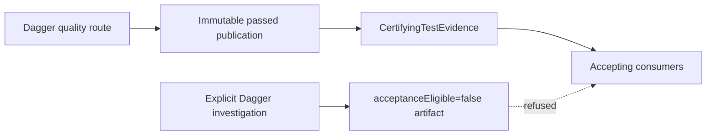

# Python Test Evidence Authority

Python acceptance has one authority: a passed, immutable, candidate-bound publication produced by
the pinned Dagger quality graph. Investigation routes may publish explicitly non-accepting
artifacts, but those artifacts cannot satisfy coverage, quality, retry, lifecycle, closeout, or
integration consumers.

## Candidate A disposition

The former host Python diagnostic route was Candidate A. Exact-candidate measurement found that
seven product nodes required 2,774 lines of command, manifest, analyzer, bootstrap, and self-proof
surface while taking roughly 39–42 seconds; the equivalent warm Dagger micro-routes took roughly
7–8 seconds. Under M14 and M31, that result failed Candidate A's retention falsifier.

The command, cohort manifest, eligibility and effect analyzer, diagnostic bootstrap, direct
runner, route-measurement implementation, and route-specific self-tests were deleted together.
The retained product assertions now run in the ordinary isolated pytest suite described in
`python-pytest-bootstrap.md`. This direct development loop has no certification authority and
does not recreate the retired analyzer, command, manifest, or proof machinery.

## Consumer inventory

The executable inventory lives in
`agents_remember_test_support.testing.consumer_inventory.ACCEPTING_CONSUMER_INVENTORY`.

| Consumer | Current owner | Required evidence |
| --- | --- | --- |
| Delivery coverage publication | `code_quality.check._pytest_step` | certifying only; metric values are diagnostic |
| Quality | `worktrees.modules.quality.clean_executor.run_clean_quality` | certifying only |
| Retry | `agents_remember_test_support.code_quality.retry_proof.prepare` | certifying only; explicit locked Dagger cache |
| Route review | `worktrees.route_review.require_current_route_review` | independent candidate-bound verdict; no test substitution |
| Lifecycle | `worktrees.modules.quality.gate.run_strict_code_quality_gate` | certifying only |
| Closeout | `worktrees.queue.closeout_staged_quality.gate_staged_code` | certifying only |
| Integration | `worktrees.integration.integration_quality.run_integration_quality_gate` | certifying only |

`CertifyingTestEvidence` in `models/test_evidence.py` has no public constructor. The Dagger executor
mints it only after a successful result is published in an immutable generation whose manifest
binds the exact candidate tree and result digest. Recovery revalidates that same generation,
passed result, and candidate binding before minting the capability again.

Certifying coverage and retry publications require the opaque `DaggerAdmission` capability.
Ordinary development coverage remains diagnostic and cannot be promoted into that authority. Lifecycle, closeout, and integration require candidate-bound certifying evidence. Route
review remains an independent plane-stamped verdict and exposes no test-evidence input. An
arbitrary object, copied non-accepting JSON, renamed file, zero exit code, failed Dagger result, or
manifest for another candidate has no authority.

## Non-accepting investigation contract

Retry-matrix, causal, cadence, and measurement functions execute in Dagger but remain review and
diagnostic evidence. Each durable artifact records exact candidate and environment identity,
population, topology, cache state, phase definitions, repetitions or attempt sequence, raw
results, and limitations. Each declares `acceptanceEligible=false` and has no publication path to
`CertifyingTestEvidence`.

Using Dagger is necessary for hermeticity but not sufficient for acceptance. Only the quality
function's verified immutable publication can cross the accepting boundary.
